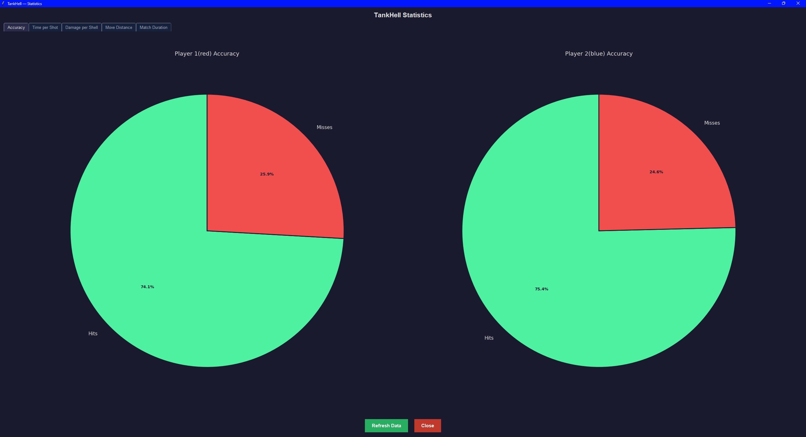
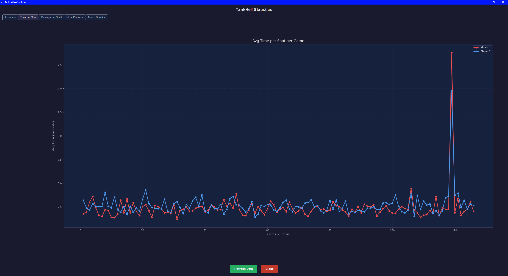
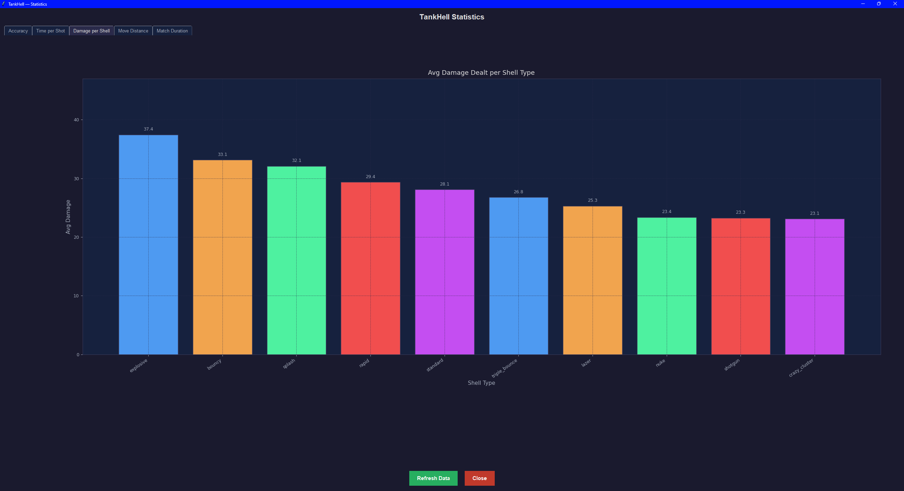
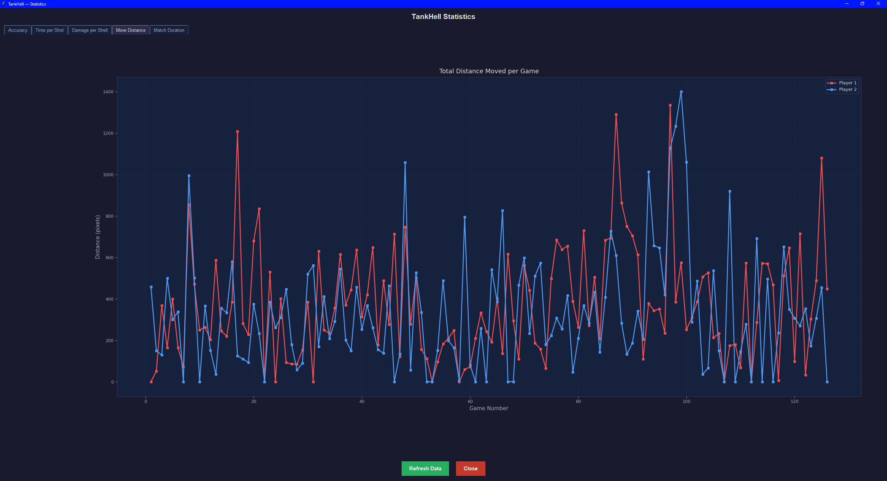
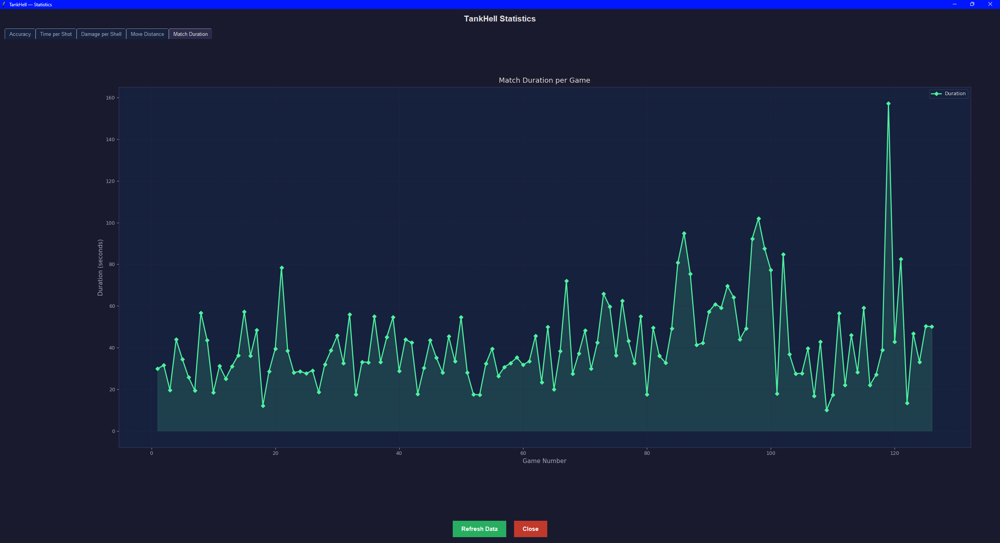

# TankHell — Data Visualization

All statistics are recorded automatically at the end of every match and persisted across sessions in CSV files stored in the `data/` directory. The TankHell Statistics dashboard is a Tkinter window with five tabs, each containing a Matplotlib chart. The data shown below was collected over approximately 130 matches.

All statistic was recorded by putting two AIs against each other. Each of the AIs get to play the game equally.

---

## Overview — Statistics Dashboard

The dashboard is a single Tkinter window titled **"TankHell Statistics"**. It is organised into five tabs along the top: **Accuracy**, **Time per Shot**, **Damage per Shell**, **Move Distance**, and **Match Duration**. A **Refresh Data** button reloads all charts from the CSV files without restarting the application, and a **Close** button shuts the window cleanly and releases all Matplotlib figure memory.

---

## 1. Accuracy (Pie Charts)

This tab displays two side-by-side pie charts — one for Player 1 (red tank) and one for Player 2 (blue tank) — showing the cumulative hit-to-miss ratio aggregated across all recorded matches. The green segment represents shots that successfully dealt damage to the enemy tank, while the red segment represents misses. 

Across roughly 130 matches, Player 1 (red) achieved a hit rate of **74.1%** while Player 2 (blue) achieved **75.4%**, indicating that both players (or the AI opponents) performed at a nearly identical level of accuracy over the full dataset. The close figures suggest the Medium AI difficulty — which was used for most recorded sessions — produces consistent, balanced hit rates for both sides.

---

## 2. Time per Shot (Line Chart)

This tab shows a dual-line chart plotting the **average time each player spent per shot** (in seconds) across every game number. Player 1 is drawn in red and Player 2 in blue. For the vast majority of matches, both players averaged between **1.5 and 4 seconds per shot**, reflecting the fast turn cadence of AI-controlled matches where the aiming animation completes quickly.

The sharp spike near game 120 — where Player 1 briefly reached approximately **19 seconds** per shot — corresponds to a session where a human player took manual control and deliberated significantly longer before firing. This outlier clearly separates AI-driven turns from human-paced play and demonstrates how the time metric is sensitive enough to distinguish the two modes of play.

---

## 3. Damage per Shell (Bar Chart)

This tab presents a bar chart of the **average total damage dealt per shell type** across all matches, sorted from highest to lowest. Each bar is coloured distinctly for readability.

The **explosive** shell leads with an average of **37.4 damage**, followed closely by **bouncy (33.1)** and **splash (32.1)**. At the lower end, **shotgun (23.3)** and **crazy_cluster (23.1)** dealt the least average damage per use. This ranking reflects both the raw damage values defined in `settings.py` and the accuracy with which each shell type connects — high-radius shells like explosive and splash are more forgiving of slight aim errors, giving them a practical damage advantage over high-speed but narrow shells like laser.

---

## 4. Move Distance (Line Chart)

This tab shows a dual-line chart of the **total distance (in pixels) each player moved** per match. Player 1 is in red and Player 2 is in blue. Movement distances vary considerably — most matches fall in the **200–600 px** range per player, but several outlier matches exceed **1,000 px**, reaching a peak of approximately **1,400 px**.

The high variance reflects the AI movement logic: on each turn the AI has a 40% chance to reposition, and if it detects it is too close to a screen edge it always moves away, which can produce large cumulative distances over a long match. Matches where both lines spike together tend to be longer-duration games where the AI repositioned many times due to repeated edge-avoidance triggers.

---

## 5. Match Duration (Area Chart)

This tab shows a filled area chart of **match duration in seconds** across all recorded game numbers. Most matches lasted between **20 and 60 seconds**, consistent with fast AI-vs-AI games that end within a handful of rounds. Several notable spikes reach above 80 seconds, and one outlier near game 120 reached approximately **157 seconds** — the longest recorded match, likely a session where neither tank landed decisive hits for an extended number of rounds due to difficult terrain geometry and high wind.

The gradual upward drift in the envelope from games 80 onward may reflect sessions played at higher difficulty settings (Hard AI), where the aiming animation and movement deliberation together add a small but consistent amount of clock time per turn compared to Easy AI matches.
